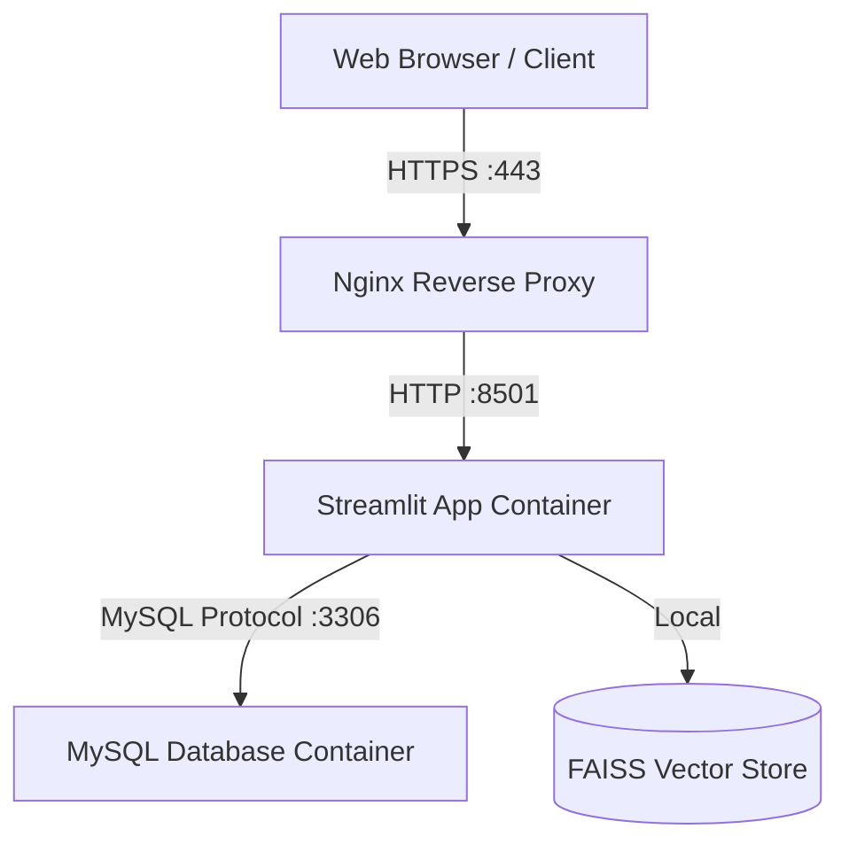

# Deployment Guide - Smart Legal Assistance

This guide outlines how to deploy the **Smart Legal Assistance** application in a production-ready environment.

---

## Deployment Architecture



---

## Option 1: VPS Deployment (Ubuntu + Docker Compose) - Recommended

This is the most direct and cost-effective method to deploy the entire multi-container stack.

### Prerequisites
1. A Linux VPS (e.g., DigitalOcean, AWS EC2, Linode, Hetzner) running Ubuntu 22.04 LTS.
2. A registered domain name pointed to your VPS IP address (e.g., `sla.example.com`).
3. Docker and Docker Compose installed on the server.

### Step 1: Install Docker on the Server
SSH into your server and run:
```bash
sudo apt update
sudo apt install -y docker.io docker-compose
sudo systemctl enable --now docker
```

### Step 2: Clone the Repository
Clone your repository to the server:
```bash
git clone https://github.com/yuktha2005/smart-legal-assistance.git
cd smart-legal-assistance
```

### Step 3: Configure Environment Variables
Create a production environment file:
```bash
cp config/.env.example config/.env
```
Edit the `.env` file (`nano config/.env`) and update the following settings:
- `DB_USER`: Keep as `root` (or define a custom user).
- `DB_PASSWORD`: Change to a strong, unique password.
- `DB_NAME`: `smart_legal_assistance`
- `SECRET_KEY`: Change to a cryptographically secure random string.

Also, update the `docker-compose.yml` file to sync these credentials:
```yaml
environment:
  - DB_PASSWORD=your_secure_password
```

### Step 4: Run the Application Stack
Launch the containers in detached (background) mode:
```bash
docker-compose up --build -d
```
Verify the status of the containers:
```bash
docker-compose ps
```

---

## Step 5: Configure Reverse Proxy & SSL (Nginx & Certbot)

For production, you should never expose port `8501` directly. Instead, route requests through Nginx with HTTPS.

### 1. Install Nginx and Certbot
```bash
sudo apt install -y nginx certbot python3-certbot-nginx
```

### 2. Configure Nginx Server Block
Create a new configuration file (`/etc/nginx/sites-available/smart-legal-assistance`):
```nginx
server {
    listen 80;
    server_name sla.example.com; # Replace with your domain

    location / {
        proxy_pass http://127.0.0.1:8501;
        proxy_set_header Host $host;
        proxy_set_header X-Real-IP $remote_addr;
        proxy_set_header X-Forwarded-For $proxy_add_x_forwarded_for;
        proxy_set_header X-Forwarded-Proto $scheme;

        # WebSockets support for Streamlit
        proxy_http_version 1.1;
        proxy_set_header Upgrade $http_upgrade;
        proxy_set_header Connection "upgrade";
        proxy_read_timeout 86400;
    }
}
```
Link the configuration and restart Nginx:
```bash
sudo ln -s /etc/nginx/sites-available/smart-legal-assistance /etc/nginx/sites-enabled/
sudo nginx -t
sudo systemctl restart nginx
```

### 3. Enable HTTPS with SSL/TLS Certificates
Run Certbot to obtain and apply a free Let's Encrypt SSL certificate:
```bash
sudo certbot --nginx -d sla.example.com
```
Follow the interactive prompts. Certbot will configure auto-renewal automatically.

---

## Option 2: Platform-as-a-Service (PaaS) - Render or Railway

If you prefer a fully managed serverless infrastructure:

### Render
1. **Database**: Create a **Managed MySQL Database** instance on Render.
2. **Web Service**: Create a new Web Service pointing to your GitHub repository.
   - Choose **Docker** as the environment.
   - Set the start command to default (defined in Dockerfile).
   - Add environment variables in Render settings matching your `.env` values (e.g., `DB_HOST` pointing to the Render MySQL host, `DB_USER`, `DB_PASSWORD`, etc.).

---

## Option 3: Local/Internal Deployment (No Docker)

If you need to deploy within a local private network:
1. Install Python 3.12 and MySQL Server.
2. Run the application:
   ```bash
   pip install -r requirements.txt
   streamlit run streamlit_app.py --server.port=8501 --server.address=0.0.0.0
   ```

---

## Production Checklist & Best Practices
- [ ] **Secrets & Passwords**: Ensure `DB_PASSWORD` and `SECRET_KEY` are changed from default values.
- [ ] **Data Persistence**: Back up the Docker volumes (`db_data`, `pdf_data`, and `processed_data`) regularly.
- [ ] **Port Security**: Configure firewall (`ufw`) to block external access to port `3306` (MySQL) and only expose `80`/`443` (Nginx).
- [ ] **Vector Store Backup**: Ensure FAISS index files in `processed_data/` are backed up regularly to avoid re-ingesting PDFs.
